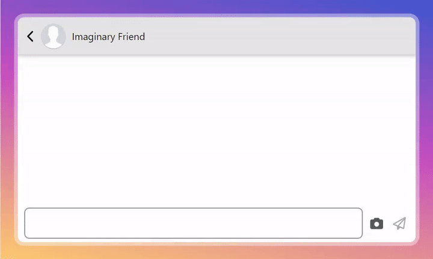
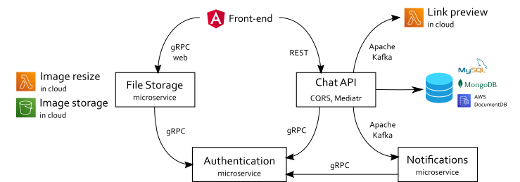

# LetsTalk - Instant messenger 💬

🔴 [Live demo](https://letstalk.petukhov.fyi/)

## Description

LetsTalk is a messaging app for exchanging text messages, images, and video calls.

This project showcases my technical skills for potential employers and IT recruiters. It demonstrates that:

- I can:
  - Design event-driven system architectures
  - Work with cloud services such as AWS SNS/SQS, S3, Lambda, and DocumentDB
  - Build single-page web applications with Angular and TypeScript
  - Implement reactive state management with NgRx in Angular
  - Work with NoSQL databases such as MongoDB, Azure CosmosDB, and Redis
- I understand:
  - The OpenAPI Specification
  - Microservice communication patterns and protocols such as gRPC
  - Microservice architecture and event-driven development principles, with hands-on experience using Apache Kafka
  - Domain-driven design and data consistency ([see my article on DDD](https://www.linkedin.com/pulse/how-i-practiced-ddd-principles-ignoring-them-evgenii-petukhov/) on LinkedIn)

## Technical stack

**Back end**
- C#, .NET 10, ASP.NET Core
- Communication: REST, gRPC, SignalR, WebRTC (Cloudflare TURN)
- CQRS: MediatR
- Databases: MySQL (Entity Framework Core), MongoDB, Redis
- Event messaging: Apache Kafka, AWS SNS/SQS (via MassTransit)
- Cloud: AWS S3, AWS Lambda, Azure CosmosDB
- Telemetry: Azure AppInsights

**Front end**
- TypeScript, Angular 21, NgRx
- Testing: Vitest

## Architecture

The front end is an Angular single-page application using NgRx for reactive state management.

The back end follows a microservice, event-driven architecture. Depending on the configuration, it uses Apache Kafka or AWS SNS/SQS as the event broker. The table below describes each microservice:

| Microservice name | Protocol                    | Description                                                                                                                    |
| ----------------- | --------------------------- | ------------------------------------------------------------------------------------------------------------------------------ |
| Chat API          | REST                        | Responsible for sending messages and account management                                                                        |
| Authentication    | gRPC                        | Generates and validates JSON Web Tokens                                                                                        |
| Notification      | Apache Kafka or AWS SNS/SQS | Sends notifications about new messages to the front-end via SignalR                                                            |
| Link preview      | Apache Kafka or AWS SNS/SQS | Decorates messages with a website's name and a picture preview in the cloud by calling AWS Lambda, if a message contains links |
| File storage      | gRPC                        | Saves avatars and images uploaded by users in the cloud (AWS S3) and serves them when requested                                |
| Image processing  | Apache Kafka or AWS SNS/SQS | Generates image previews in the cloud by calling AWS Lambda; uses [SkiaSharp](https://github.com/mono/SkiaSharp)               |
